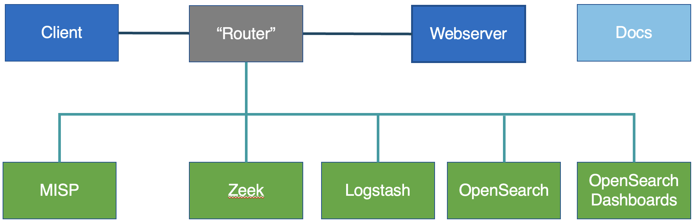

# Environment design

- Everything is on a private network
- Small amount of traffic: lets us focus on things that we trigger

- Main communication is between `client` and `webserver`
    - The only command needed here on `client` is `curl webserver`
- Traffic is routed through `router` which mirrors it to `zeek`
- `zeek` runs in "standalone" mode, which uses one core for processing and reduces other complexity
    - good enough for our purposes!
	- zeek here uses the pre-packaged CentOS7 binaries
- `zeek` also runs `filebeat` which ships logs, in JSON format, to `logstash`
- `logstash` then processes the logs and ships them to `opensearch`
- `opensearch` and `opensearch dashboards` use the basic example from [opensearch.org](https://opensearch.org/docs/latest/install-and-configure/install-opensearch/docker/)
    - Don't use in production!

- `misp` uses the NUKIB (Czech CSIRT) [docker deployment](https://github.com/NUKIB/misp)
    - A future iteration will use the [Jisc deployment](https://github.com/JiscCTI/misp-docker)
	

