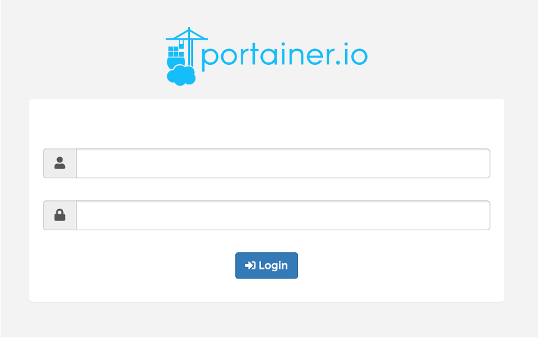
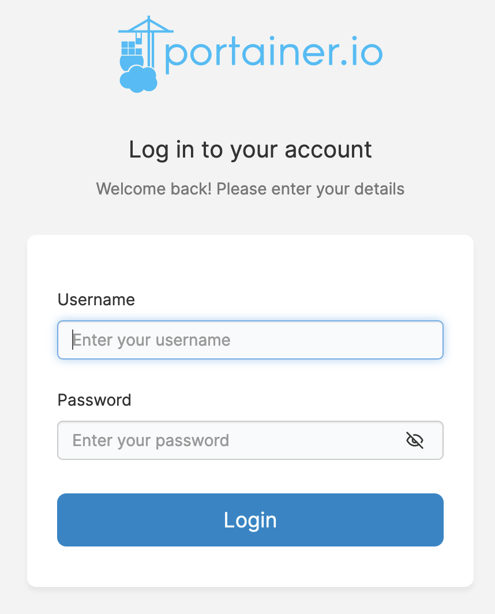

# Exercise 1: Portainer

In the first exercise, we'll explore the Portainer interface which acts as the orchestrator for this environment. 

1. Open a new window or tab using the link on the front page of these notes to open Portainer, and login with the credentials provided

2. The main page you're presented with should look something like this. Click where it says `2 stacks`

3. Click on `pocketsoc-ng`

4. If you scroll down the page, you'll see a list of containers

5. To access the terminal for a given container, click on the `>_` icon

6. Explore the rest of the interface, which gives information on the deployment. You can always get back to the list of containers through the `Containers` link or `Stacks` followed by `pocketsoc-ng` as above

