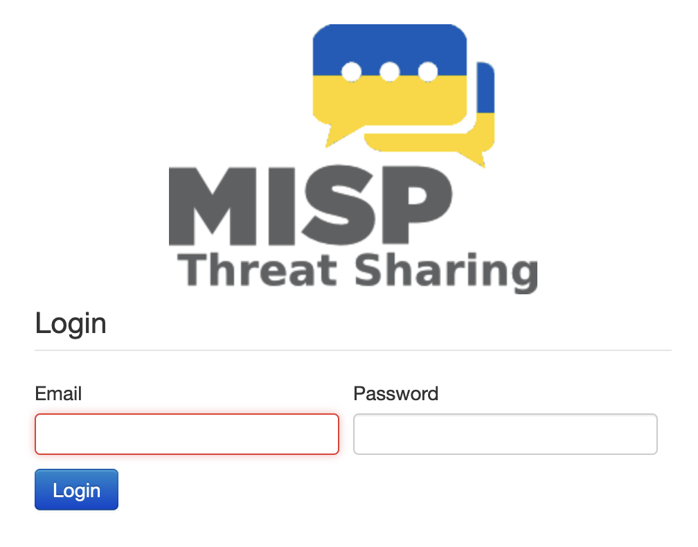
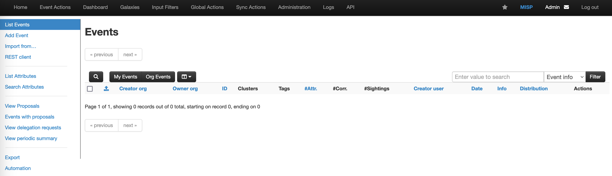
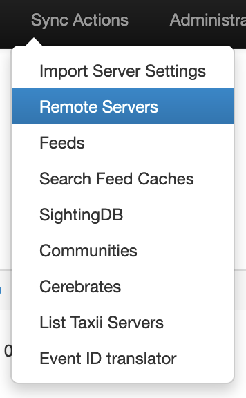
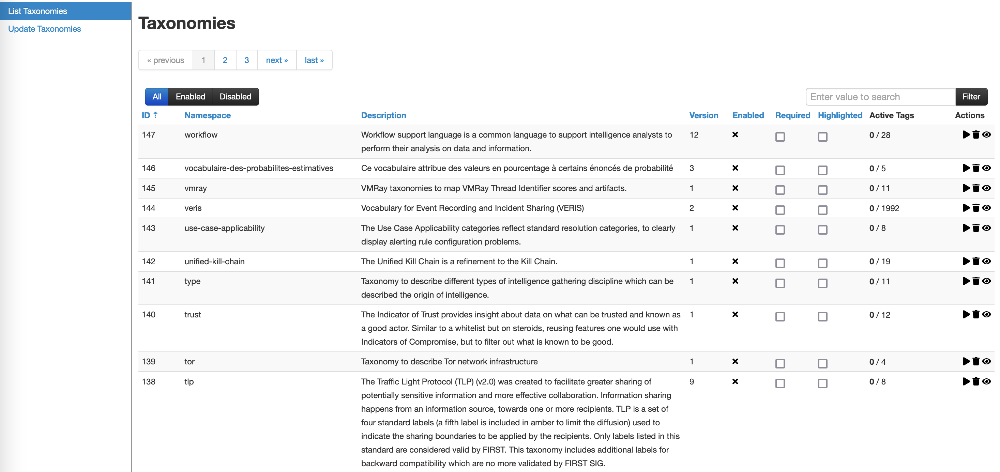
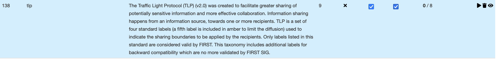
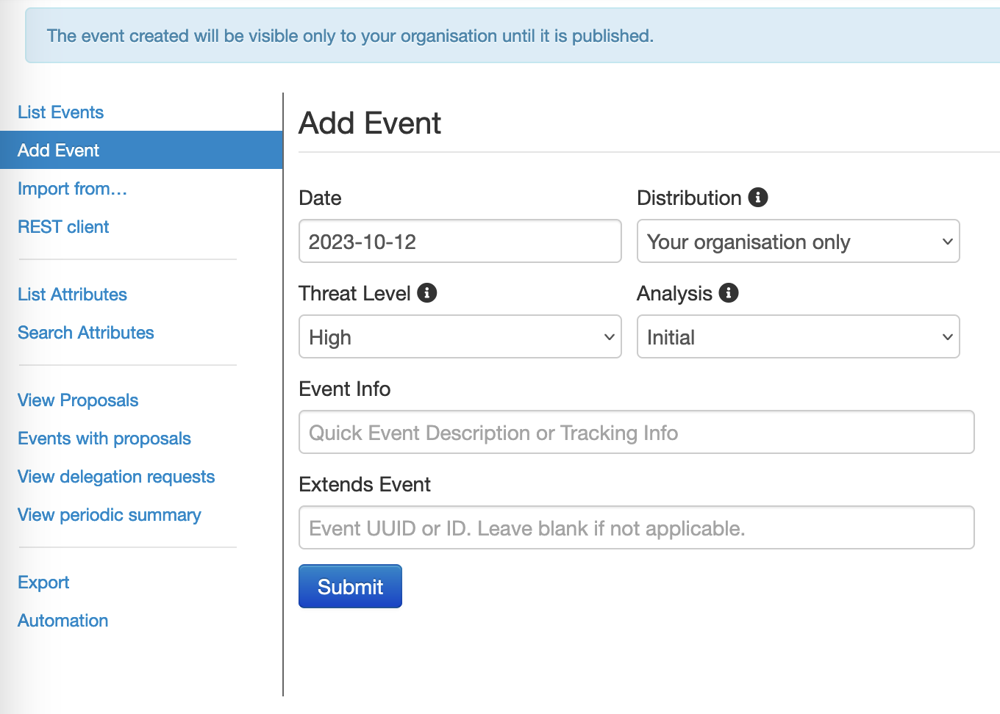
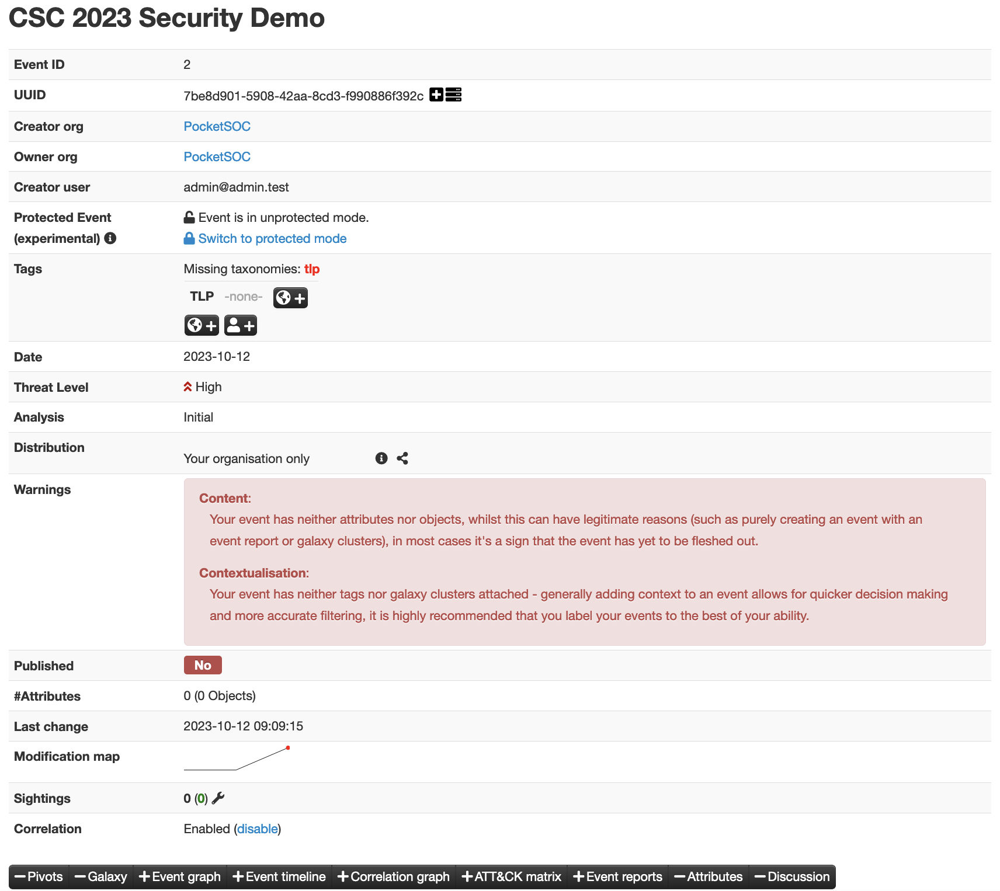
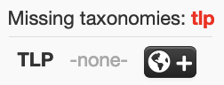
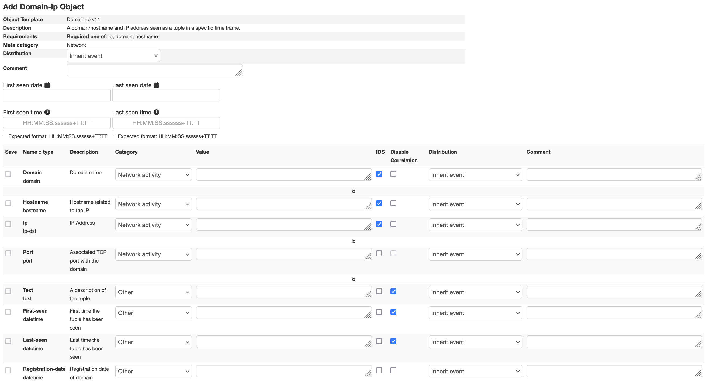
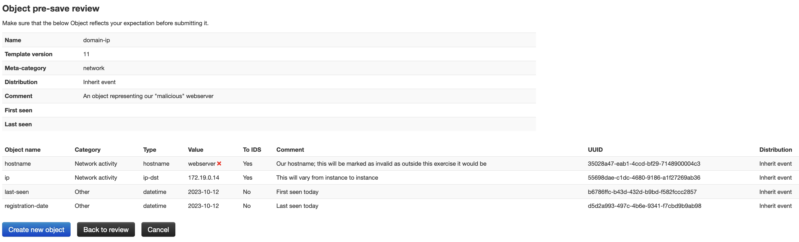

# Exercise 6: MISP

Having generated some logs using zeek, we're now going to explore MISP.

1. Use the link and credentials on the front page to access your MISP website

2. You should see an "Events" page that's blank

3. If you click on *Automation* at the bottom of the list of options on the left-hand side, you can find a very detailed set of docs on the API access for MISP. This includes a copy of your API key, so in general be careful when opening this page!
4. For reference, if you wanted to sync to another instance, you would use the "Remote Servers" option under "Sync Actions" - if you have a look at this, click "Home" to get back to the main screen

5. Before we create an event, we want to make sure that all our events will have a TLP setting. Go to "Event Actions" and select "Taxonomies"

6. We want to require TLP and also highlight it: this will make it easier to select when creating an event. Click these two options for TLP and then the "Play" icon to enable (mousing over will confirm which icon to use): click OK to confirm. Then click "enable all" to enable all the tlp options.

7. Let's now explore the "add event" option: this will allow us to generate an event based on the findings of our "malicious" webserver

8. There are a number of options here: let's look at them:
    - Date: self explanatory
	- Distribution:
	    - Your organisation only: will not be shared outside this instance
		- This community only: will only be shared with instances in your community
		- Connected communities: will be shared with any communities connected to yours but no further
		- All communities: will be shared with any MISP instance any number of hops from you
	- Threat level: self explanatory
	- Analysis: allows you to specify whether these are your initial findings, part way through an extended analysis, or form the completed version of your findings
	- Event Info: A brief description of the event
	- Extends Event: Not used for a new incident, but could be used if you are basing your findings on another event
9. For Distribution, this can typically be used to set how far your event will be propagated: for our purposes we can stick with "Your Organisation only"
10. Enter some explanatory text and options, and click "Submit". You will see some metadata about this event, with some useful warnings about things you may want to add to your event, like attributes!

11. We're going to start by adding a TLP tag to our event to indicate the sharing level: this is good practice so that it's always clear which is why we have required it for all of our events. 

12. We're going to use `tlp:amber`: choose from the dropdown and Submit.
13. If you scroll down, you'll see another warning that we haven't included any attributes, so let's add some now.
14. Good practice is, rather than adding individual attributes, to add *objects*. These allow you to add a set of related attributes - such as all the information about a file, for example, or all information about a URL or domain. 
15. We'll start by adding a "network" object. Go to Add Object, and start typing "network". Click on that option and you'll see another option dropdown - start typing "domain" and choose "domain:ip"

16. This page lets us fill in all the information we have about given domain/ip. We can add:
    - Hostname: webserver
	- IP: (the IP you identified earlier)
	- You might also add first seen/last seen as today
17. It's good practice to put comments wherever you have the option to, so add comments both to the object itself and the individual attributes, then click Submit. You'll see a review of the information, then click "Create new object" if you're happy

