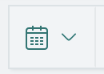
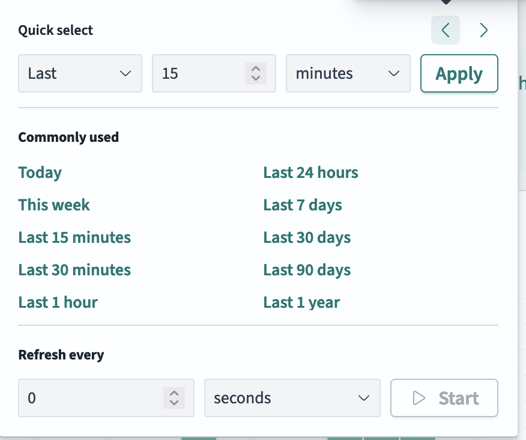
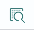

# Exercise 3: Explore the data

We want to narrow down the set of information being shown; by default, each record shows the full message being sent from zeek 

2. To set the data to live update, click the calendar icon at the top

3. Set to refresh every 10 seconds (say)

3. Under available fields on the left hand side, scroll and select `id.orig_h`, `id.resp_h`. What do these refer to?
4. Most of the IPs will start `172.[].[].[]` - these are the private addresses being used in the environment. You might see other IPs - these will be most likely other CERN addresses: you can check using `dig -x [].[].[].[]` on `lxplus`, for example
5. Scroll through the other fields to see what is available, then add `type`: what types of data are being captured?
6. Click on the magnifying glass on the left hand side of a record to see a full readout of the information collected; compare the output for the different types of record

