# Exercise 2

In this exercise, we'll setup the OpenSearch Dashboards interface. If you're familiar with OpenSearch Dashboards then feel free to skip ahead, otherwise follow these steps - this is a fresh installation.

1. Log in using the credentials on the front page
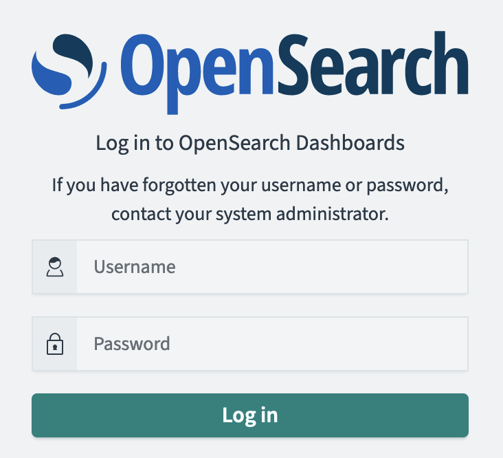
2. Select "Explore on my own" (Zeek will provide the data!)
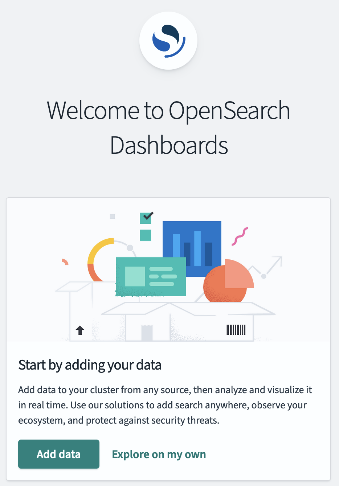
3. Dismiss the "new Dashboards" notice
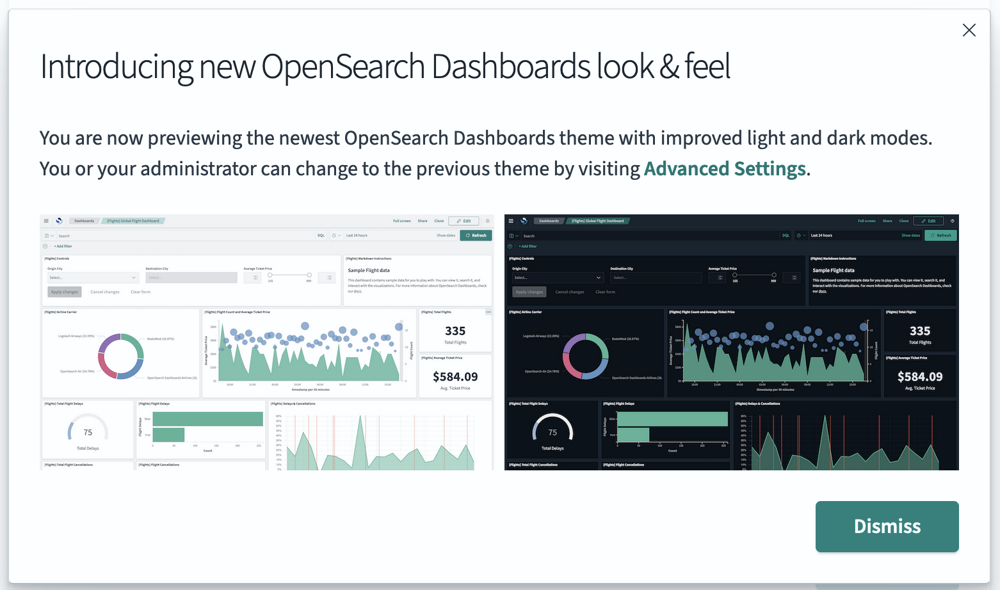
4. Confirm "private tenant"
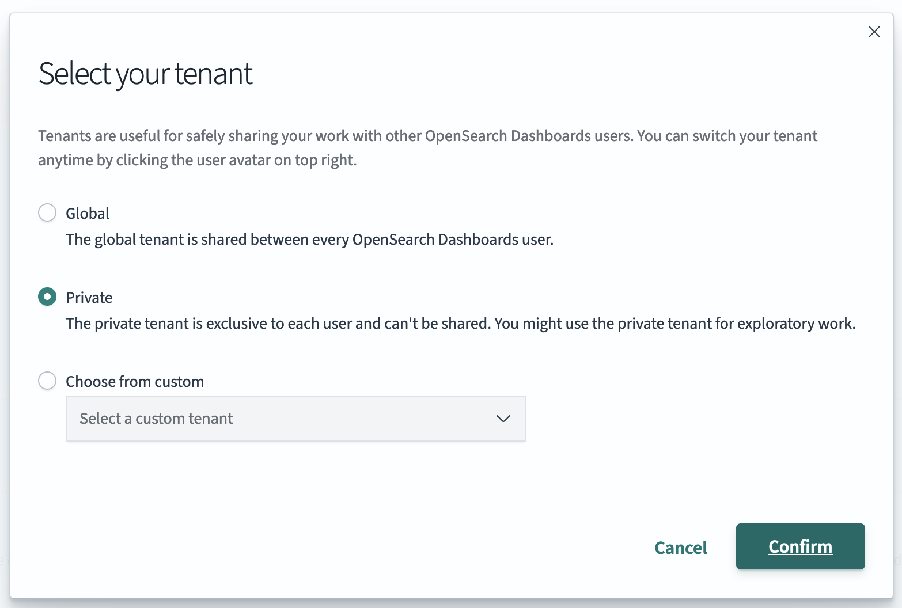
5. You should see this view
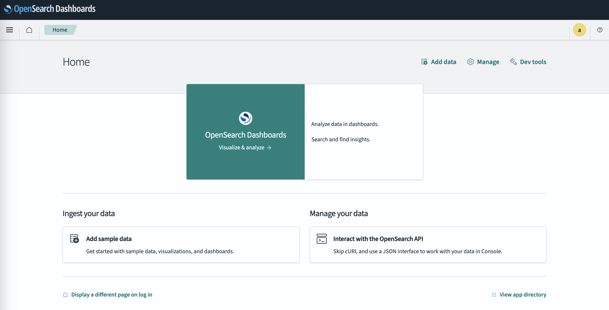
6. Click the three bar menu in the top left and select “Discover”
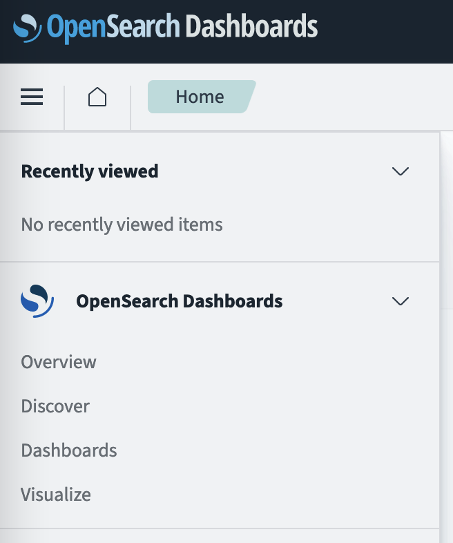
7. Now we need to create an *index pattern* to select which records to display. Click on “Create index pattern”
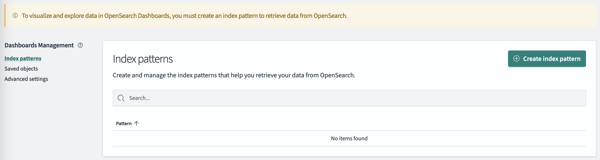
8. You should see something like the following, with `opensearch-logstash-zeek-2023.10.12`
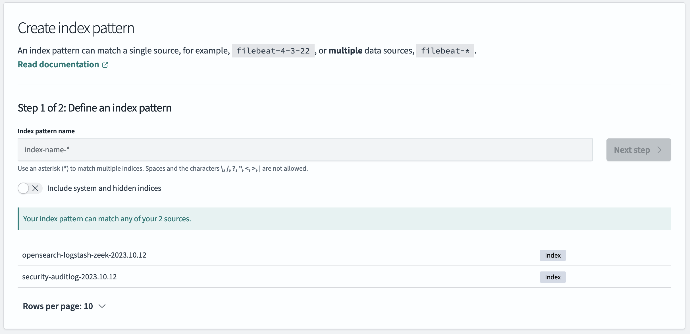
9. Enter `opensearch-logstash-zeek-*` (this will match multiple days): Next step.
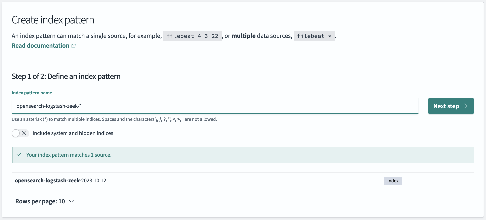
10. Select @timestamp in the Time field
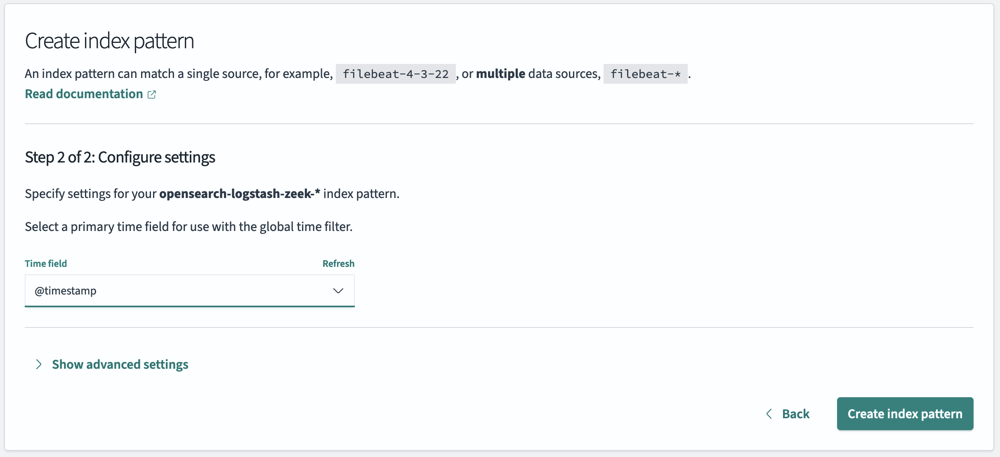
11. You should see something like this
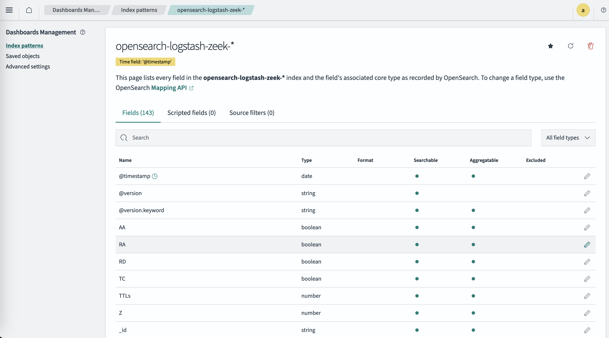
12. From the menu select Discover again: at the top left of the window you’ll see “Select a datasource” : choose the index pattern you just created
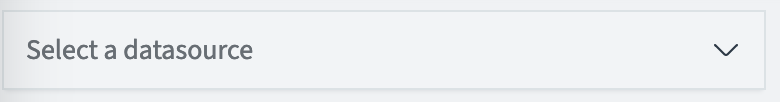
131. You should see some data: time to explore!
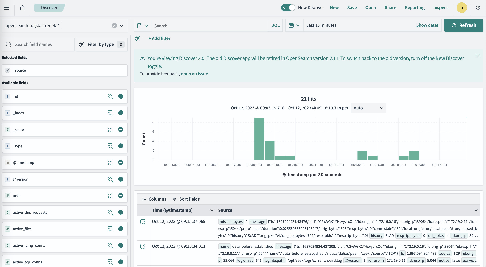

